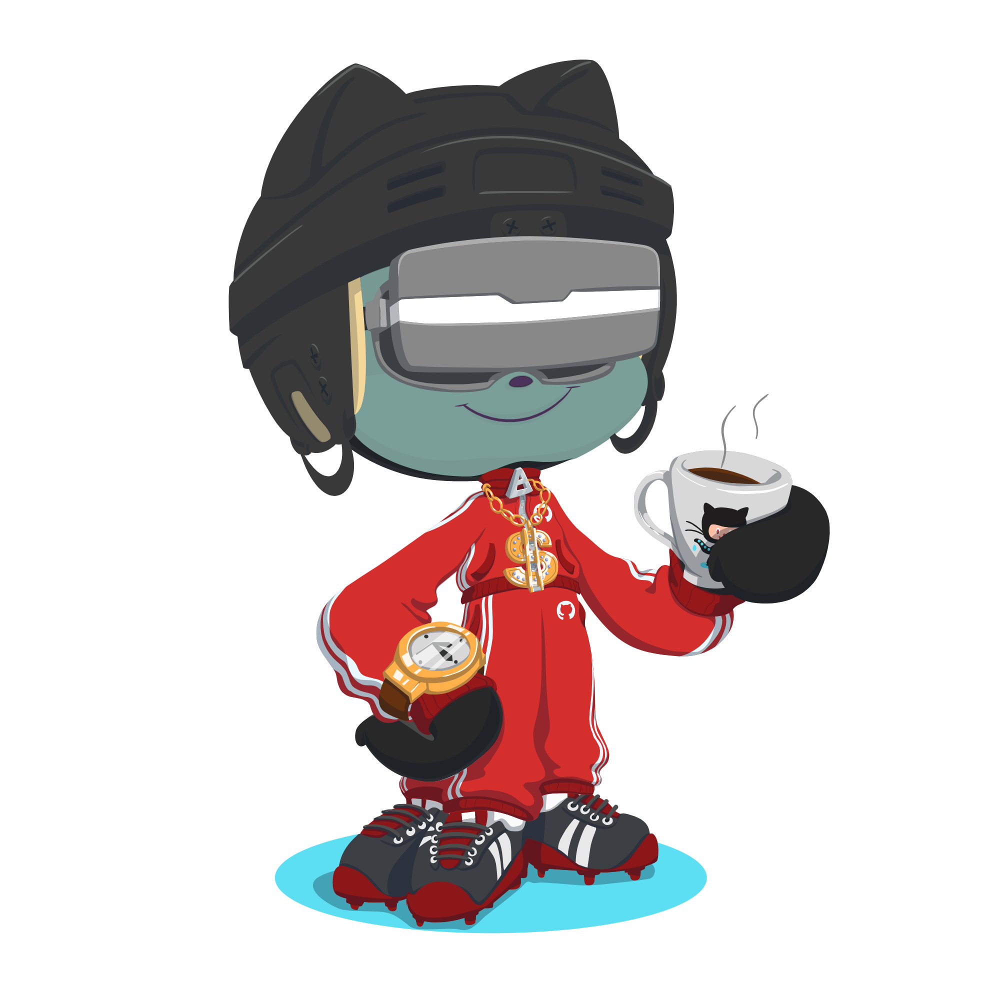

<head>
    
  
  

  <!---->
  
  
</head>
<body>
  

     
  

  

  

      
  
  
  
  

  

    
  
    
  <footer>
    
 
        
        
        
        
        
    

      

  

  </footer>
</body>
</html>
